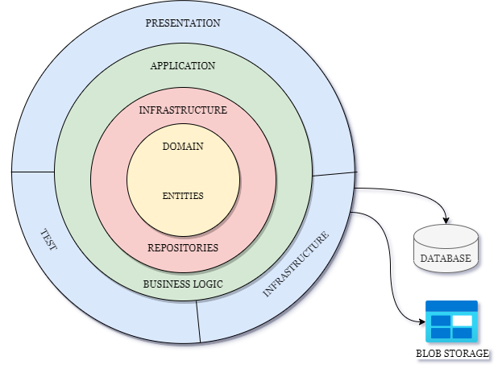
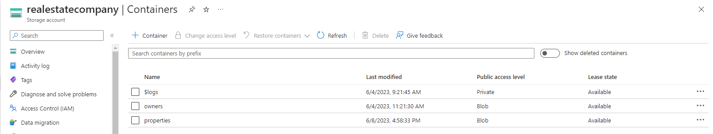
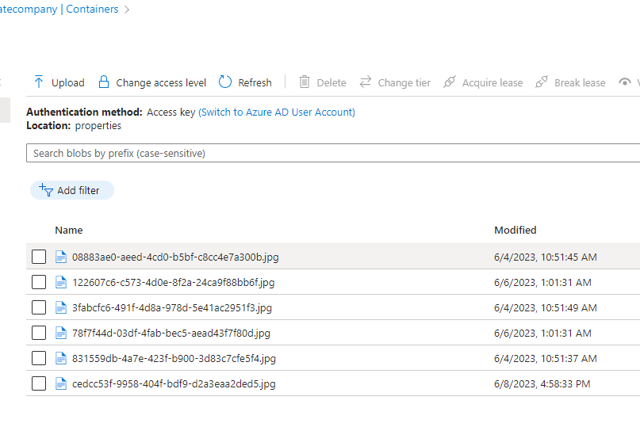
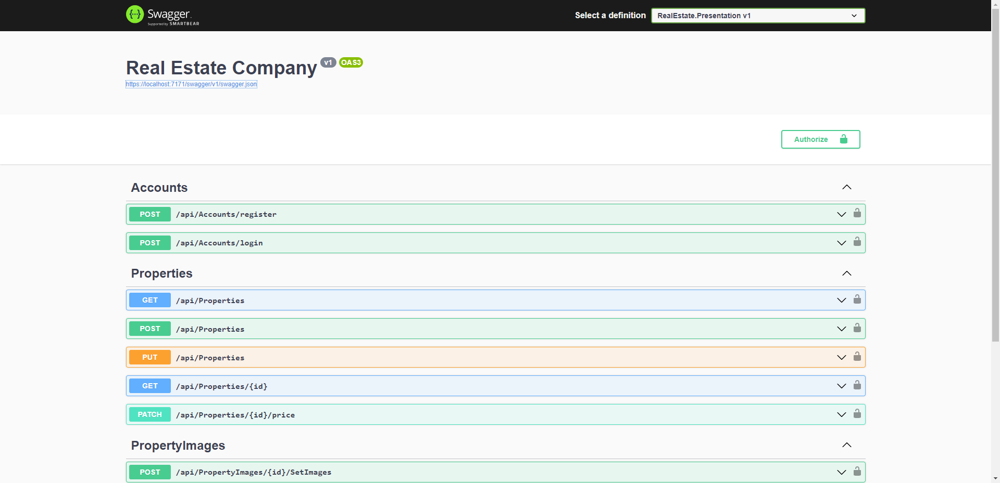
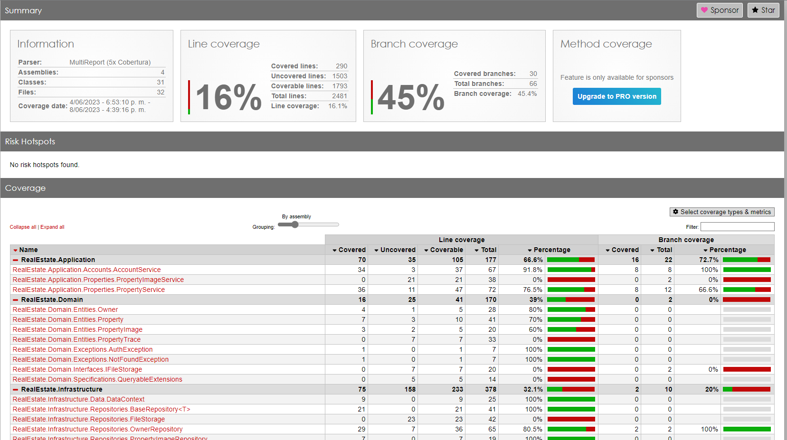

# Real Estate Company Web API

The API Real Estate Company web application is a platform designed to obtain information about properties in the United States. It allows owners to create, update and add photos of their properties. The application follows a clean architecture and is developed in .NET Core 7.0, using the Clean Architecture design pattern to ensure a clear separation of responsibilities and easy maintainability.

## Main features

- **Create Property Building:** This functionality allows the owner of a property to add a new property.
- **Add Image from property:** This feature allows the owner to store photos of their properties.
- **Change Price:** This function allows you to update the price of the property.
- **Update Property:** This functionality allows you to update property features.
- **List property with filters:** You can use filters and pagination to search for properties using this feature.
- **Login:** Added a login endpoint for owners to access and view their property information.
- **Register:** A user registry was added so that owners can perform all the above mentioned functionalities.

## Installation and configuration

1. Clone the repository.
2. Make sure you have installed [.NET Core SDK](https://dotnet.microsoft.com/download) or install [Visual studio](https://visualstudio.microsoft.com/es/downloads/).
3. Make sure you have SQL SERVER installed locally. Or download Docker to add an [SQL SERVER image](https://hub.docker.com/_/microsoft-mssql-server).
4. Configure the database connection string in appsettings.json.
```json=
{
  "ConnectionStrings": {
    "LocalConnection": <<your Connection String>>,
  }
}
```
5. Run the solution
## Architecture
The application follows the Clean Architecture. The layer structure is as follows:

```diff=
 - RealEstate.sln
    - RealEstate.Presentation
    - RealEstate.Application
    - RealEstate.Domain
    - RealEstate.Infrastructure
    - RealEstate.Test
```

### Architecture diagram



## Technologies used
- .NET Core 7.0
- NUnit (for unit test)
- SQL Server
- Azure Blob Storage

## Azure Blob Storage
To upload both property images and owner photos, Azure's Blob Storage was used for storage. In this way, the database records the public URL of the image.



# API endpoints

### Security
**Bearer**  

| apiKey | *API Key* |
| ------ | --------- |
| Name | Authorization |
| In | header |
| Description | JWT Authorization header using the Bearer scheme. <br /> <br />                        Enter 'Bearer' [space] and then your token in the text input below.<br /> <br />                        Example: 'Bearer 12345abcdef'<br /> <br /> |

---
### /api/Accounts/register

#### POST
##### Parameters

| Name | Located in | Description | Required | Schema |
| ---- | ---------- | ----------- | -------- | ------ |
| Email | formData |  | Yes | string (email) |
| Name | formData |  | Yes | string |
| Address | formData |  | Yes | string |
| Photo | formData |  | No | file |
| Birthday | formData |  | Yes | dateTime |
| Password | formData |  | Yes | password |
| PasswordConfirm | formData |  | Yes | password |

##### Responses

| Code | Description |
| ---- | ----------- |
| 200 | Success |

### /api/Accounts/login

#### POST
##### Parameters

| Name | Located in | Description | Required | Schema |
| ---- | ---------- | ----------- | -------- | ------ |
| body | body |  | No | [AuthDTO](#authdto) |

##### Responses

| Code | Description |
| ---- | ----------- |
| 200 | Success |

---
### /api/Properties

#### GET
##### Parameters

| Name | Located in | Description | Required | Schema |
| ---- | ---------- | ----------- | -------- | ------ |
| Page | query |  | No | integer |
| RecordsNumber | query |  | No | integer |
| Filters | query |  | No | string |

##### Responses

| Code | Description |
| ---- | ----------- |
| 200 | Success |

#### POST
##### Parameters

| Name | Located in | Description | Required | Schema |
| ---- | ---------- | ----------- | -------- | ------ |
| body | body |  | No | [PropertyDTO](#propertydto) |

##### Responses

| Code | Description |
| ---- | ----------- |
| 200 | Success |

#### PUT
##### Parameters

| Name | Located in | Description | Required | Schema |
| ---- | ---------- | ----------- | -------- | ------ |
| body | body |  | No | [PropertyDTO](#propertydto) |

##### Responses

| Code | Description |
| ---- | ----------- |
| 200 | Success |

### /api/Properties/{id}

#### GET
##### Parameters

| Name | Located in | Description | Required | Schema |
| ---- | ---------- | ----------- | -------- | ------ |
| id | path |  | Yes | integer |

##### Responses

| Code | Description |
| ---- | ----------- |
| 200 | Success |

### /api/Properties/{id}/price

#### PATCH
##### Parameters

| Name | Located in | Description | Required | Schema |
| ---- | ---------- | ----------- | -------- | ------ |
| id | path |  | Yes | integer |
| body | body |  | Yes | [PropertyPriceDTO](#propertypricedto) |

##### Responses

| Code | Description |
| ---- | ----------- |
| 200 | Success |

---
### /api/PropertyImages/{id}/SetImages

#### POST
##### Parameters

| Name | Located in | Description | Required | Schema |
| ---- | ---------- | ----------- | -------- | ------ |
| id | path |  | Yes | integer |
| propertyImages | formData |  | No | [ binary ] |

##### Responses

| Code | Description |
| ---- | ----------- |
| 200 | Success |

---
### Models

#### AuthDTO

| Name | Type | Description | Required |
| ---- | ---- | ----------- | -------- |
| email | string (email) |  | Yes |
| password | string |  | Yes |

#### PropertyDTO

| Name | Type | Description | Required |
| ---- | ---- | ----------- | -------- |
| id | integer |  | No |
| name | string |  | Yes |
| address | string |  | Yes |
| price | double |  | Yes |
| codeInternal | string |  | Yes |
| year | integer |  | Yes |

#### PropertyPriceDTO

| Name | Type | Description | Required |
| ---- | ---- | ----------- | -------- |
| price | double |  | Yes |

## Swagger
In the `docs` folder you will find the `swagger.yaml` file, which contains a detailed description of the endpoints available in the API, as well as examples of their execution. You can use this file to clearly visualize the API structure and test the different endpoints directly from the Swagger environment. We recommend opening the `swagger.yaml` file in a text editor or Swagger visualization tool to get a better understanding of the endpoints and how they work.




## Unit testing
The application contains unit tests written in NUnit. An example of a unit test for a service is shown below:

```csharp=
[TestFixture]
public class PropertyRepositoryTests
{
    private DataContext _context;

    [SetUp]
    public void Setup()
    {
        var options = new DbContextOptionsBuilder<DataContext>()
            .UseInMemoryDatabase(databaseName: "testDatabase")
            .EnableSensitiveDataLogging(true)
            .Options;
        _context = new DataContext(options);
    }

    [Test]
    public async Task FindByIdAsync_ShouldReturnProperty()
    {
        // Arrange
        _context.Properties.AddRange(PropertyMocks.GetList());
        await _context.SaveChangesAsync();
        int propertyId = 1;
        var propertyRepository = new PropertyRepository(_context);
        // Act
        var property = await propertyRepository.FindByIdAsync(propertyId);
        // Asserts
        Assert.NotNull(property);
        Assert.That(property!.Id, Is.EqualTo(propertyId));
        Assert.That(property.Name, Is.EqualTo("My House"));
    }
}
```
Run the following commands to view the Coverage Report

```bash=
dotnet test --collect:"XPlat Code Coverage"
```
Report Generator
```bash=
reportgenerator "-reports:./**/coverage.cobertura.xml" "-targetdir:./CoverageReport" "-reporttypes:Html"
```
 
Go to folder CoverageReport and open in browser index.html


